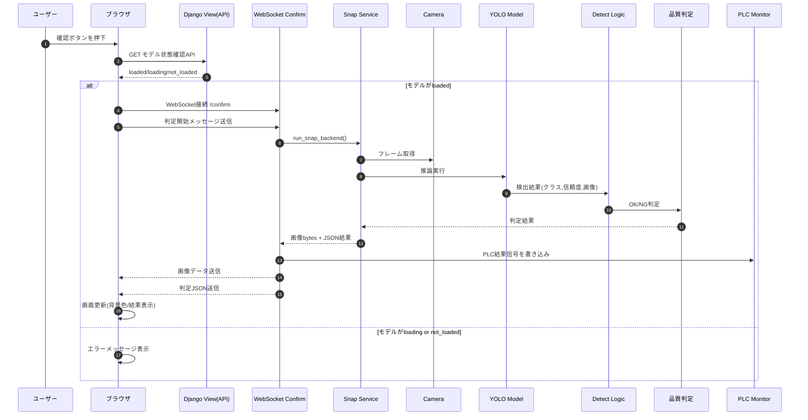
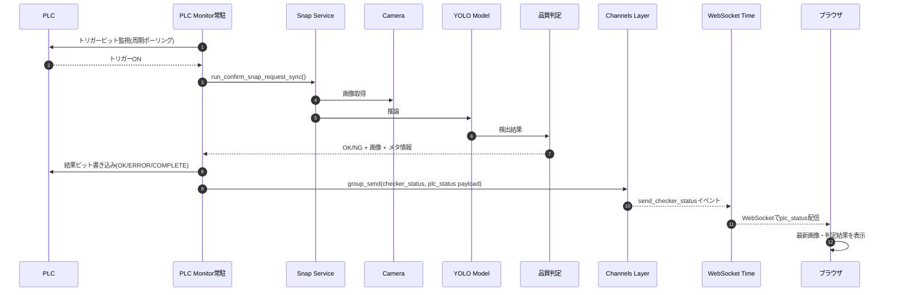
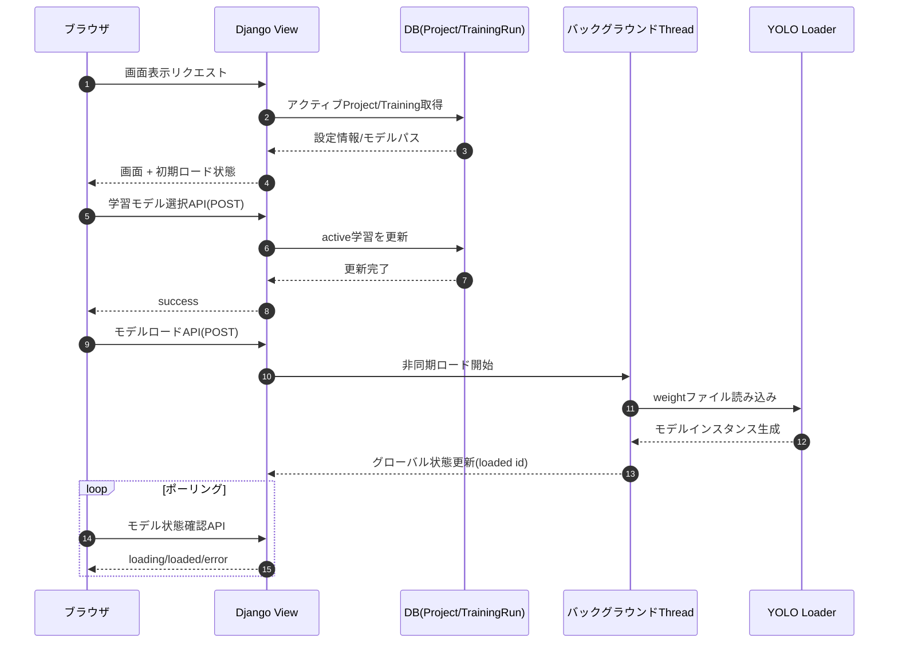

# checkerアプリ 通信ステップ図

このドキュメントは `yolo_system/checker` アプリの主要な通信ステップを Mermaid で表現したものです。

## 1. 手動判定フロー（確認ボタン）

```mermaid
sequenceDiagram
    autonumber
    participant U as ユーザー
    participant B as ブラウザ
    participant V as Django View(API)
    participant WS as WebSocket Confirm
    participant S as Snap Service
    participant C as Camera
    participant M as YOLO Model
    participant D as Detect Logic
    participant Q as 品質判定
    participant P as PLC Monitor

    U->>B: 確認ボタンを押下
    B->>V: GET モデル状態確認API
    V-->>B: loaded/loading/not_loaded

    alt モデルがloaded
        B->>WS: WebSocket接続 /confirm
        B->>WS: 判定開始メッセージ送信
        WS->>S: run_snap_backend()
        S->>C: フレーム取得
        S->>M: 推論実行
        M->>D: 検出結果(クラス,信頼度,画像)
        D->>Q: OK/NG判定
        Q-->>S: 判定結果
        S-->>WS: 画像bytes + JSON結果
        WS->>P: PLC結果信号を書き込み
        WS-->>B: 画像データ送信
        WS-->>B: 判定JSON送信
        B->>B: 画面更新(背景色/結果表示)
    else モデルがloading or not_loaded
        B->>B: エラーメッセージ表示
    end
```

## 2. PLCトリガー自動判定フロー

```mermaid
sequenceDiagram
    autonumber
    participant PLC as PLC
    participant PM as PLC Monitor常駐
    participant S as Snap Service
    participant C as Camera
    participant M as YOLO Model
    participant Q as 品質判定
    participant CH as Channels Layer
    participant WT as WebSocket Time
    participant B as ブラウザ

    PM->>PLC: トリガービット監視(周期ポーリング)
    PLC-->>PM: トリガーON

    PM->>S: run_confirm_snap_request_sync()
    S->>C: 画像取得
    S->>M: 推論
    M->>Q: 検出結果
    Q-->>PM: OK/NG + 画像 + メタ情報

    PM->>PLC: 結果ビット書き込み(OK/ERROR/COMPLETE)
    PM->>CH: group_send(checker_status, plc_status payload)
    CH-->>WT: send_checker_statusイベント
    WT-->>B: WebSocketでplc_status配信
    B->>B: 最新画像・判定結果を表示
```

## 3. モデルロード/切替フロー（画面初期化・学習選択時）

```mermaid
sequenceDiagram
    autonumber
    participant B as ブラウザ
    participant V as Django View
    participant DB as DB(Project/TrainingRun)
    participant T as バックグラウンドThread
    participant Y as YOLO Loader

    B->>V: 画面表示リクエスト
    V->>DB: アクティブProject/Training取得
    DB-->>V: 設定情報/モデルパス
    V-->>B: 画面 + 初期ロード状態

    B->>V: 学習モデル選択API(POST)
    V->>DB: active学習を更新
    DB-->>V: 更新完了
    V-->>B: success

    B->>V: モデルロードAPI(POST)
    V->>T: 非同期ロード開始
    T->>Y: weightファイル読み込み
    Y-->>T: モデルインスタンス生成
    T-->>V: グローバル状態更新(loaded id)

    loop ポーリング
        B->>V: モデル状態確認API
        V-->>B: loading/loaded/error
    end
```
